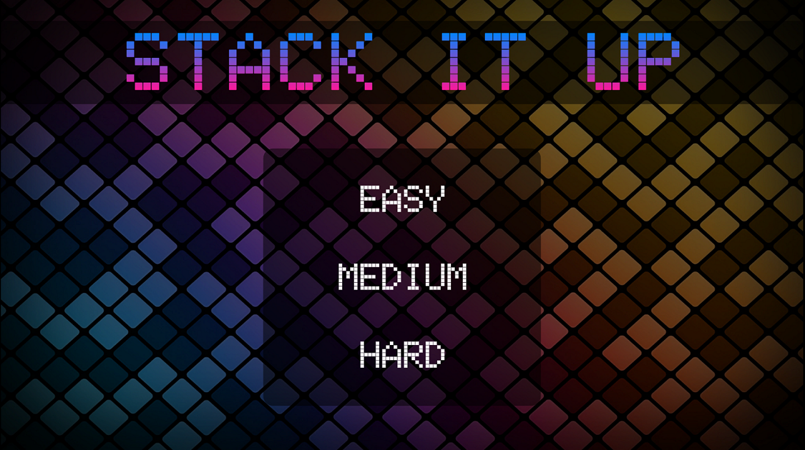

# Stack It Up

**Stack It Up** is an exciting 2D game that combines elements from Tetris and Tower Stack, resulting in a unique gameplay experience. The objective is to stack blocks as high as possible to reach the finish line. Here's a breakdown of the game mechanics:

## Online Version and Builds
An online version of the game is available at [stack-it-up.dinip.pt](https://stack-it-up.dinip.pt/).

Additionally, you can find builds of the game on the [Releases tab](https://github.com/Dinip/StackItUp/releases).

# Instructions

## Controls
The player uses their mouse, which is equipped with a circle, to interact with the blocks. The circle serves as a pushing mechanism to move the blocks around and stack them.

## Stacking
The objective for the player is to strategically stack blocks on a platform, which can come in various shapes such as squares, rectangles, and L-shaped blocks, reminiscent of Tetris-inspired shapes. The goal is to carefully position the blocks to construct a sturdy tower that maintains stability.

## Game Difficulty
The game offers multiple difficulty levels, which determine the height of the finish line and the number of hearts the player has. The higher the difficulty, the taller the finish line and the fewer hearts the player gets.

### Difficulty Menu

## Heart System
The player starts with a certain number of hearts, which represent their lives. If a block falls off the bottom platform or slips off the sides, the player loses a heart. The game continues until the player runs out of hearts.

## Finish Line
The finish line represents the desired height for the stacked blocks to reach. It can have different heights depending on the chosen difficulty. To complete the game, the player must stack the blocks up to or beyond the finish line.

## Winning Condition
When a block crosses the finish line, the player needs to ensure that their circle is not colliding with any placed block. If the circle is touching a block, the player must stop touching the block for at least 2 seconds. Only then will the game end, and the player will be declared the winner. If the circle is still touching a block after 2 seconds, the game continues.

## Game Over
The game ends when the player loses all their hearts due to blocks falling off or if the player fails to stack the blocks up to the finish line within the given lives.

### Game Screenshot
